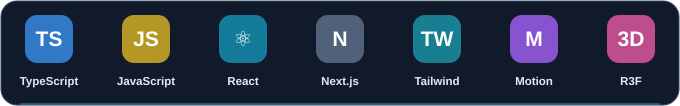
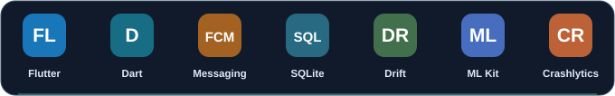
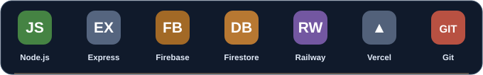
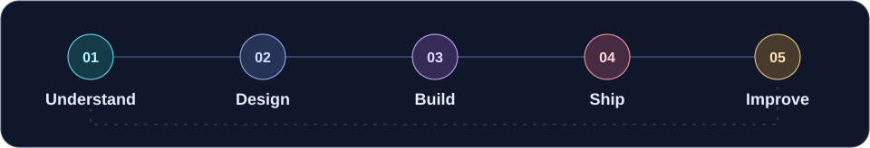

<picture>
  <source media="(max-width: 600px)" srcset="./assets/hero-mobile.svg">
  
</picture>

### I turn ambitious ideas into products people use.

**Founder · [EduWindow Private Limited](https://eduwindow.tech)** 
**Co-Founder · [Zudex Technologies Private Limited](https://zudex.in)**

Product thinking. Full-stack engineering. Mobile experiences. Long-term ownership.

**[LinkedIn ↗](https://www.linkedin.com/in/aryanmehta0027)** &nbsp; / &nbsp; **[Let’s talk ↗](mailto:founder@eduwindow.tech)** &nbsp; / &nbsp; **[EduWindow ↗](https://eduwindow.tech)** &nbsp; / &nbsp; **[Zudex ↗](https://zudex.app)**

---

## 👋 The builder behind the products

I'm **Aryan Mehta**, a founder and software engineer building across education technology and hyperlocal commerce. I work across the product lifecycle: understanding a workflow, designing the experience, building the web and mobile applications, connecting the backend, and operating the result after launch.

With **EduWindow**, I'm connecting the people and everyday operations of an institution. With **Zudex**, I'm building the software that brings customers, vendors, and commerce operations together.

I care about what happens after a feature ships: whether someone understands it, whether a team can depend on it, and whether it solves the problem it was built for.

| What I've built | Where it stands |
| :--- | :--- |
| 🏫 **EduWindow** | Live institutional platform with **3 web dashboards + 2 mobile apps** |
| 🛍️ **Zudex** | Live commerce platform with a **web presence + 3 mobile apps** |
| 👥 **Zudex adoption** | **5,000+ registered users**, growing |
| 📱 **Public app listings** | **4 Google Play listings** across both products |

*Product footprint and registered-user milestone shared September 2026. Zudex's third app is not listed on Google Play.*

## 🚀 Products I'm building

### EduWindow · Founder

**One vision. One mission. One window.**

An institutional operating system for **schools, colleges, and coaching centres**. EduWindow brings administration, academics, communication, financial workflows, and operational visibility into a connected product ecosystem.

| Area | What the platform brings together |
| :--- | :--- |
| 🏛️ **People & administration** | Institutional administration, student records, teacher management, parent experiences, and role-based dashboards |
| 📚 **Academic delivery** | Attendance, timetables, homework, notes, tests, assessments, and classroom workflows |
| 💳 **Fees & accounts** | Fee assignment, instalments, payment workflows, collection visibility, payment proofs, and student fee views |
| 🎯 **Admissions & CRM** | Enquiries, leads, admission pipelines, counsellor follow-ups, applications, and communication |
| 🚌 **Campus operations** | Transport management, fleet and fuel visibility, HR workflows, and inventory management |
| 📊 **Insights & intelligence** | Attendance, homework, test, and student-learning insights; reports, dashboards, automation, and AI-assisted experiences |
| 🌐 **Connected experiences** | Institutional websites and portals, mobile apps, notifications, APIs, and integrations |

**Explore:** [Website ↗](https://eduwindow.tech) · [Teacher app ↗](https://play.google.com/store/apps/details?id=com.aryan.eduwindow.teacher) · [Student & parent app ↗](https://play.google.com/store/apps/details?id=com.aryan.eduwindow.student)

 

### Zudex · Co-Founder

**Local commerce, connected through software.**

A live hyperlocal commerce platform with **5,000+ registered users and growing**. The ecosystem spans web and **three mobile applications**, including the public customer and vendor apps.

- **Customer experience:** a dedicated app connecting users with the commerce platform.
- **Vendor experience:** a separate app for the vendor side of the ecosystem.
- **Connected operations:** web and mobile experiences supporting a multi-role product.
- **Engineering focus:** orders, payment integrations, notifications, location-based workflows, and automation.

**Explore:** [zudex.in ↗](https://zudex.in) · [zudex.app ↗](https://zudex.app) · [User app ↗](https://play.google.com/store/apps/details?id=in.zudex.user.app) · [Vendor app ↗](https://play.google.com/store/apps/details?id=com.zudex.app.vendor)

## 📲 Try the live apps

| Application | Audience | Open on Google Play |
| :--- | :--- | :--- |
| **EduWindow Teacher** | Teachers managing their classroom day | [Teacher app ↗](https://play.google.com/store/apps/details?id=com.aryan.eduwindow.teacher) |
| **EduWindow Student & Parent** | Students and families staying connected | [Student app ↗](https://play.google.com/store/apps/details?id=com.aryan.eduwindow.student) |
| **Zudex User** | Customers in the Zudex ecosystem | [User app ↗](https://play.google.com/store/apps/details?id=in.zudex.user.app) |
| **Zudex Vendor** | Vendors on the Zudex platform | [Vendor app ↗](https://play.google.com/store/apps/details?id=com.zudex.app.vendor) |

## 🧩 What I can build with you

| Capability | The work behind it |
| :--- | :--- |
| **Product & SaaS engineering** | Turning business workflows into multi-tenant platforms, role-based experiences, admin tools, and connected products |
| **Web applications** | Responsive websites, full-stack applications, dashboards, forms, reporting, and operational interfaces |
| **Mobile applications** | Flutter apps, authentication, secure storage, local persistence, push notifications, and location-aware experiences |
| **Backend & integrations** | REST APIs, payments, webhooks, background jobs, file handling, email, maps, and third-party services |
| **AI & data experiences** | AI-assisted workflows, face detection integrations, analytics, visualisations, and evidence-based dashboards |
| **Interface craft** | Clear information hierarchy, accessible interactions, responsive layouts, motion, and 3D web experiences |
| **Production ownership** | Deployment, access control, session handling, audit trails, monitoring integrations, and ongoing iteration |

## 🛠️ My engineering toolkit

These are technologies and engineering practices I use across my products, with EduWindow as a major part of that work.

### 🔵 Web & interface engineering

**TypeScript · JavaScript · React · Next.js · Tailwind CSS · Framer Motion · React Three Fiber / Drei**

App Router architecture, responsive interfaces, reusable components, forms with React Hook Form and Zod, dashboards with Recharts, and interactive 3D experiences.

### 🟢 Mobile & device experiences

**Flutter · Dart · Firebase Cloud Messaging · SQLite / Drift · Google ML Kit · Crashlytics · Remote Config**

Teacher and student apps, secure local storage, local data persistence, push notifications, camera and file workflows, geolocation, WebViews, and app release workflows.

### 🟠 Backend, cloud & delivery

**Node.js · Express · Firebase Admin · Firestore · Firebase Auth · Cloud Storage · Cloud Functions · Railway · Vercel · Git / GitHub**

REST APIs, event-driven workflows, background workers, webhook processing, tenant-aware data access, dashboard caching and read models, file uploads, and deployment configuration.

### 🟣 AI, integrations & trust

| Area | Technologies and implementation experience |
| :--- | :--- |
| **AI & vision** | Google Gemini integrations, TensorFlow.js, face-api, and ML Kit face detection |
| **Payments & communication** | Razorpay, payment webhooks, Resend, Firebase Cloud Messaging, and telephony integrations |
| **Location & operations** | Google Maps, geolocation, and MaxMind IP geolocation for login audit context |
| **Documents & media** | PDF generation with pdf-lib, XLSX exports, QR codes, Sharp, and image/file processing |
| **Identity & access** | Firebase Auth, role-based access, tenant scoping, secure sessions, and MFA workflows |
| **Application safeguards** | Input validation with Zod, security headers with Helmet, audit logging, and webhook verification |

<strong>🔍 More of the systems work behind the interfaces</strong>

 

- **Connected data:** structuring records and permissions around institutions, roles, and the workflows they share.
- **Operational dashboards:** combining summaries, trends, filters, comparisons, and drill-down views into useful tools.
- **Background processing:** moving repeated work into event-driven jobs and keeping dashboard reads efficient.
- **Payment workflows:** handling collection records, proof review, payment events, and financial visibility.
- **Mobile integration:** connecting device capabilities and local persistence with a shared product backend.
- **Communication flows:** coordinating app notifications, emails, follow-ups, and service integrations.
- **Production visibility:** implementing audit trails and integrating crash reporting and analytics.
- **Visual polish:** combining motion, responsive layout, and 3D interfaces where they improve the experience.

## ⚡ How I work

1. **Understand the work.** Start with the people, constraints, and decisions the product needs to support.
2. **Design the experience.** Make the important actions clear across web, mobile, and different user roles.
3. **Build the system.** Connect the interface, backend, data model, permissions, and integrations.
4. **Ship and operate.** Deploy, observe how the product behaves, and take ownership of the details.
5. **Improve from real use.** Use feedback and operational evidence to decide what to build next.

## 🤝 Let's talk products, partnerships, and growth

I'm interested in conversations with **clients, collaborators, and investors** around useful software, connected platforms, and the next stage of EduWindow and Zudex.

- **Clients:** SaaS platforms, mobile applications, dashboards, business workflows, and integrations.
- **Partners:** opportunities around education technology and hyperlocal commerce.
- **Investors:** product vision, current adoption, and growth conversations for the ventures I'm building.

### Have a product challenge or a partnership in mind?

**[founder@eduwindow.tech](mailto:founder@eduwindow.tech)** 
[Connect on LinkedIn ↗](https://www.linkedin.com/in/aryanmehta0027)

**Built with intention. Shipped for real people. Improved through use.**

